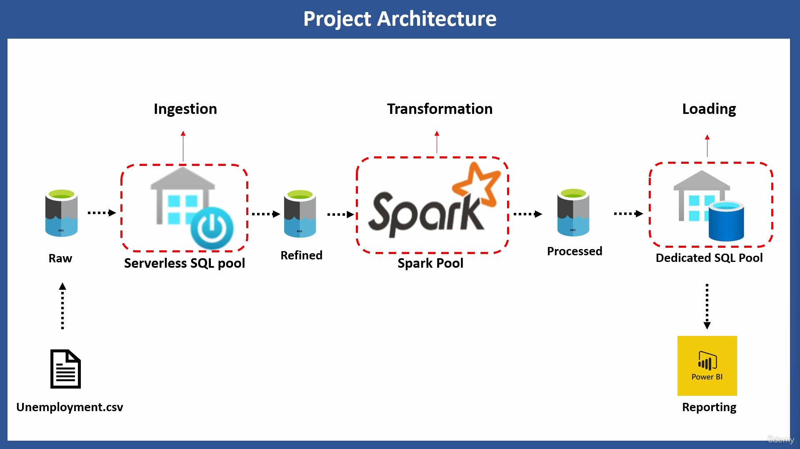

# 🚀 PROJECT ARCHITECTURE - Un-Employment Data Analysis

## PROJECT OVERVIEW

### Tech Stacks:
- 🌐 Azure Data Factory
- 🌐 Azure Synapse Analytics (Serverless SQL Pool & Dedicated SQL Pool)
- 🌐 Spark Pools
- ☁️ Azure Data Lake Storage Gen 2
- 📊 Power BI

Welcome to my project where the synergy of Azure technologies orchestrates seamless data integration, transformation, and dazzling reporting. Below is a journey through each pivotal component:

### Objective: To analyze unemployment trends in specific states (California, New York, New Jersey) using Azure Synapse Analytics and associated tools.

### Key Steps:

### Data Ingestion:
- Ingested raw unemployment data from a CSV file stored in Azure Data Lake Storage.
- Utilized Azure Data Factory pipelines to automate data ingestion and ensure timely updates.

### Initial Data Exploration and Cleansing:

- Employed Serverless SQL Pool in Azure Synapse Analytics to conduct initial data exploration and cleansing.
- Selected relevant columns, handled missing values, and corrected data inconsistencies.

### Data Transformation:

- Leveraged PySpark within Azure Synapse Spark Pool to execute complex data transformations.
- Applied filtering, joining, aggregation, grouping, and window functions to analyze unemployment rates, trends, and correlations.
- Created databases, tables, and views using Spark SQL for efficient data management.

### Data Storage:

- Stored processed, cleaned data in the "refined" container within Azure Data Lake Storage.
- Implemented Delta Lake to enable version control, time travel, and ACID compliance for the structured data.

### Business Reporting:

- Developed interactive Power BI dashboards to visualize unemployment trends, compare across states, and identify key factors influencing unemployment rates.
